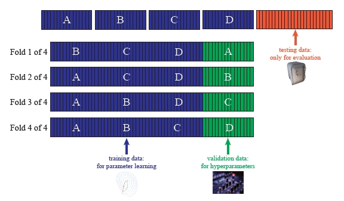

```{r, load_refs, include=FALSE, cache=FALSE}
library(RefManageR)
library(tidyverse)
BibOptions(check.entries = FALSE,
           bib.style = "authoryear",
           style = "markdown",
           hyperlink = FALSE,
           dashed = TRUE)
biblio <- ReadBib("../../References/References.bib", check = FALSE)
```

# Plan for the Day

1. Discuss how to assess model fit

2. Model validation

3. Counterfactual simulations

4. Go through examples from a couple of recent papers

    - `r Citet(biblio,"fu_al2020")`

    - `r Citet(biblio,"langPalacios2018")`

---
# Steps to producing a "structural" estimation

- We discussed the structural workflow in our 3rd class meeting

- Since that class meeting, we've focused mainly on estimation

- We also briefly talked about identification

- But there are still some steps we haven't covered

- Counterfactuals are where you actually answer your research question

- And before counterfactuals you need to show your model fits the data


---
# Model Fit

- Model fit basically consists of showing that your model can match the data

- This is because the counterfactuals rely solely on the model

- Most model fit is _ad hoc_: you can choose what to show

- Typically, you'll want to show that moments of the $Y$ variables match

- e.g. choice frequencies in the data match choice probabilities of the model

- But there may be other moments of interest, like dynamic choice transitions


---
# Example from `r Citet(biblio,"fu_al2020")`

- In this paper, the authors show the following model fit statistics:

```{r echo=FALSE, results="asis"}
res <- tibble(
Variable = c('Ever arrested %','Always enrolled, 0 arrest %','GPA (standardized)','Retention %','Grade Completed by T'),
Data = c(5.6,72.2,-0.39,7.3,11.1),
Model = c(5.1,71.1,-0.43,8.0,11.2)
)
knitr::kable(head(res), format = 'html')
```

- These results are for youth with parents who are not well educated

- (This group is the most at risk to be arrested or drop out of school)

- Model fit for other groups is similar

---
# How to do model fit

There are a couple of options for producing model fit statistics

1. Use the model assumptions and estimates to simulate a new dataset

2. Use the data and estimates to compute $\hat{Y}$ and compare with $Y$

---
# Simulating a new dataset

- To simulate a new data set, you simply draw the unobservables from the model

- Use any initial conditions from the data

- Then (if the model is dynamic) simply draw $Y$ in $t=1$

- Then update the $X$'s in $t=2$ and draw $Y$ in $t=2$, ...

- If you used SMM to estimate the model, you should already have code for this

- Typically you want to repeat this process a few times

- This is because you don't want model fit to be subject to simulation error

---
# Assessing model fit from the data and estimates

- A simpler option is to predict the $\hat{Y}$ using the actual data

- This is identical to using a `predict()` function (like in PS6)

- However, this approach may not be possible in a model with key latent variables

- For example, unobserved types or other unobservables are not in the data

- In this case, you have no choice but to go the simulation route

---
# Model Validation

- Even if your model fits the data well, some may still be skeptical

- This is because, in most cases, you used your entire dataset in estimation

- If you do this, you open yourself up to the possibility of .hi[overfitting]

- .hi[Model validation] is a way of showing that your model is not overfit

- To do so, you show that the model reproduces key stats in a "holdout sample"

- This sample was "held out" of the estimation for purposes of validation

---
# Mini aside on machine learning

Machine learning is all about automating two hand-in-hand processes:

1. Model selection
    - What should the specification be?

2. Model validation
    - Does the model generalize to other (similar) contexts?

- The goal of machine learning is to automate these processes to maximize prediction

- This is different than the goal of econometrics (causal inference)

---
# Model selection

- In classical econometrics, we always select our models by hand

- This what the famed and sometimes maligned "robustness checks" address

- In machine learning, we let the computer tell us which specification is "best"

- "Best" is defined by minimizing both in- and out-of-sample prediction error

- This involves estimating many different specifications

- For complex models, automated model selection is computationally intensive

- `r Citet(biblio,"rust1987")` did this by hand when exploring the shape of the cost function


---
# Model validation

- Broadly speaking, model validation is about whether the model "makes sense"

- It can be qualitative ("do the parameter results make sense? conform to theory?")

- It can also be quantitative ("is the prediction error sufficiently low?")

- In machine learning, .hi[cross-validation] is typically used

- Cross-validation informs about the optimal complexity of the model

- Then we (can) automate our specification search subject to that optimal complexity

- Automated specification search is still not commonly done in structural estimation

---
# How cross-validation works  `r Citep(biblio,"adams2018")`

.center[]

- Blue is the data that we use to estimate the model's parameters
- We randomly hold out $K$ portions of this data one-at-a-time (Green boxes)
- We assess the performance of the model in the Green data
- This tells us the optimal complexity (by "hyperparameters" if CV is automated)

---
# Validation in  `r Citet(biblio,"langPalacios2018")`

- A common question is how much unobserved heterogeneity to allow for

- This is not _ex ante_ knowable

- Typical approach is to put "enough" in there such that the in-sample fit is good

- `r Citet(biblio,"langPalacios2018")` search for optimal number of types

- Use a 20% holdout sample to assess the out-of-sample fit

- Note that they do not do cross-validation

- They simply compare how the model fits in the estimation and holdout data


---
# Validation in  `r Citet(biblio,"delavandeZafar2019")`

- Another form of validation could be to predict treatment effects in control group

- If the model is good, it should be able to do this

- `r Citet(biblio,"delavandeZafar2019")` do something similar to this

- Rather than comparing model predictions in/out of sample,

- They compare them for a different state of the world

- In their case, the new state of the world is one without schooling costs

- They can do this because they elicited preferences for schooling under both regimes

- But they only used one regime when estimating their model

---
# Counterfactuals

- Counterfactuals involve changing the model, simulating new data and then comparing w/status quo

- "Changing a policy" typically can be captured by changing the value of a set of parameters

- "Policy experiments" typically mimic some real-world policy in this way

- .hi[Note:] policy experiments always assume invariance of the other model parameters!

- So if I change the value of one parameter, that won't "leak" into any others

- This may be a heroic assumption, depending on the model

---
# Examples of counterfactuals

.smaller[
- `r Citet(biblio,"fu_al2020")`
    - Would low-SES youth commit fewer crimes if we sent them to better schools?
    
- `r Citet(biblio,"arcidiacono_al2016")`
    - How would human capital investment change if there were perfect information?
    
- `r Citet(biblio,"akr_legacy2019")`
    - Would Harvard become less white if it were to eliminate legacy admissions?
    
- `r Citet(biblio,"ransom2019")`
    - Would American workers move to a new city if they were paid $10,000 to do so?
    
- `r Citet(biblio,"caucutt_al2020")`
    - What can reduce disparities in child investment across rich/poor families?
]

---
# How to do counterfactuals

- To perform the counterfactual simulations, follow these steps:

    - Impose parameter restrictions
    
    - Simulate fake data under those restrictions
    
    - Compare the resulting model summary to a "baseline" prediction
    
    - (The baseline prediction is your model fit)
    
- As you can see, if you use SMM, you've already got the code to simulate the model


---
# Coding example: multinomial logit estimation

This code comes from the first question of Problem Set 4:

.scroll-box-16[
```{julia,eval=F}
using Random, LinearAlgebra, Statistics, Optim, DataFrames, CSV, HTTP, GLM, ForwardDiff, FreqTables

# read in data
url = "https://raw.githubusercontent.com/OU-PhD-Econometrics/fall-2020/master/ProblemSets/PS4-mixture/nlsw88t.csv"
df = CSV.read(HTTP.get(url).body)
X = [df.age df.white df.collgrad]
Z = hcat(df.elnwage1, df.elnwage2, df.elnwage3, df.elnwage4, 
         df.elnwage5, df.elnwage6, df.elnwage7, df.elnwage8)
y = df.occ_code

# estimate multionomial logit model
include("mlogit_with_Z.jl")
θ_start = [ .0403744; .2439942; -1.57132; .0433254; .1468556; -2.959103; .1020574; .7473086; -4.12005; .0375628; .6884899; -3.65577; .0204543; -.3584007; -4.376929; .1074636; -.5263738; -6.199197; .1168824; -.2870554; -5.322248; 1.307477]
td = TwiceDifferentiable(b -> mlogit_with_Z(b, X, Z, y), θ_start; autodiff = :forward);
θ̂_optim_ad = optimize(td, θ_start, LBFGS(), Optim.Options(g_tol = 1e-5, iterations=100_000, show_trace=true, show_every=50));
θ̂_mle_ad = θ̂_optim_ad.minimizer
H  = Optim.hessian!(td, θ̂_mle_ad)
θ̂_mle_ad_se = sqrt.(diag(inv(H)))
```
]

---
# Coding example: model fit and counterfactuals

Now let's evaluate model fit and effect of counterfactual policy

.scroll-box-16[
```{julia,eval=F}
# get baseline predicted probabilities
function plogit(θ, X, Z, J)
    α = θ[1:end-1]
    γ = θ[end]
    K = size(X,2)
    bigα = [reshape(α,K,J-1) zeros(K)]
    P = exp.(X*bigα .+ Z*γ) ./ sum.(eachrow(exp.(X*bigα .+ Z*γ)))
    return P
end
println(θ̂_mle_ad)
P = plogit(θ̂_mle_ad, X, Z, length(unique(y)))

# compare with data
modelfitdf = DataFrame(data_freq = 100*convert(Array, prop(freqtable(df,:occ_code))), P = 100*vec(mean(P'; dims=2)))
display(modelfitdf)

# now run a counterfactual:
# suppose people don't care about wages when choosing occupation
# this means setting θ̂_mle_ad[end] = 0
θ̂_cfl = deepcopy(θ̂_mle_ad)
θ̂_cfl[end] = 0
P_cfl = plogit(θ̂_cfl, X, Z, length(unique(y)))
modelfitdf.P_cfl = 100*vec(mean(P_cfl'; dims=2))
modelfitdf.ew   = vec(mean(Z'; dims=2))
modelfitdf.diff = modelfitdf.P_cfl .- modelfitdf.P
display(modelfitdf)
│ Row │ data_freq │ P       │ P_cfl   │ diff      │ ew      │
│     │ Float64   │ Float64 │ Float64 │ Float64   │ Float64 │
├─────┼───────────┼─────────┼─────────┼───────────┼─────────┤
│ 1   │ 10.5976   │ 11.2549 │ 8.34334 │ -2.91158  │ 1.96627 │
│ 2   │ 5.24943   │ 6.21553 │ 4.98708 │ -1.22845  │ 1.85026 │
│ 3   │ 38.6462   │ 37.5457 │ 34.4537 │ -3.092    │ 1.71771 │
│ 4   │ 4.66067   │ 4.88623 │ 5.70078 │ 0.814551  │ 1.54756 │
│ 5   │ 1.54063   │ 1.80065 │ 1.62727 │ -0.173382 │ 1.75298 │
│ 6   │ 15.1525   │ 14.676  │ 15.123  │ 0.447092  │ 1.58918 │
│ 7   │ 18.3571   │ 17.3364 │ 23.3689 │ 6.03245   │ 1.42956 │
│ 8   │ 5.79588   │ 6.28457 │ 6.39589 │ 0.111316  │ 1.59501 │
```
]

---
# Discussion of model fit counterfactuals

- Model fit is good, and I would have expected even better

- MLE is designed to match the data choice frequencies

- The counterfactuals make sense

- Removing preference for earnings leads to re-sorting of occupations

- Sorting into low-wage occupations and out of high-wage ones

---
# Confidence intervals around counterfactuals

- The counterfactuals above give us a new predicted occupational distribution

- But we don't know what the confidence intervals are around the prediction

- Our estimates inherently come with sampling variation

- We should incorporate that variation into our counterfactual

- How do we do this? Bootstrapping

---
# Bootstrapping to get CIs around counterfactuals

- Recall: $-H^{-1}$ is the variance matrix of our estimates, where $H$ is the Hessian

- Assume that $\hat{\theta} \sim MVN(\theta,-H^{-1})$

    - but remember that we want to minimize $-\ell$ so we just use $H^{-1}$

- We sample from this distribution $B$ times and compute our new counterfactuals

- Then we can look at the 2.5th and 97.5th percentiles

- This will represent a 95% confidence interval

- This algorithm is known as the .hi[parametric bootstrap]

- Cf. .hi[nonparametric bootstrap] which is when we randomly re-sample from our data

---
# Coding example: parametric bootstrap

- Here's how we can get the confidence interval around the policy effect

- Note: it's uncommon to see this, due to computational demands of just one cfl

.scroll-box-12[
```{julia,eval=F}
# now do parametric bootstrap
Random.seed!(1234)
invHfix = UpperTriangular(inv(H)) .- Diagonal(inv(H)) .+ UpperTriangular(inv(H))' # this code makes inv(H) truly symmetric (not just numerically symmetric)
d = MvNormal(θ̂_mle_ad,invHfix)
B = 1000
cfl_bs = zeros(8,B)
for b = 1:B
    θ_draw = rand(d)
    Pb = plogit(θ_draw, X, Z, length(unique(y)))
    Pbs = 100*vec(mean(Pb'; dims=2))
    θ_draw[end] = 0
    P_cflb = plogit(θ_draw, X, Z, length(unique(y)))
    Pcfl_bs = 100*vec(mean(P_cflb'; dims=2))
    cfl_bs[:,b] = Pcfl_bs .- Pbs
end
bsdiffL = deepcopy(cfl_bs[:,1])
bsdiffU = deepcopy(cfl_bs[:,1])
for i=1:size(cfl_bs,1)
    bsdiffL[i] = quantile(cfl_bs[i,:],.025)
    bsdiffU[i] = quantile(cfl_bs[i,:],.975)
end
modelfitdf.bs_diffL = bsdiffL
modelfitdf.bs_diffU = bsdiffU
display(modelfitdf)
│ Row │ data_freq │ P       │ P_cfl   │ diff      │ ew      │ bs_diffL  │ bs_diffU  │
│     │ Float64   │ Float64 │ Float64 │ Float64   │ Float64 │ Float64   │ Float64   │
├─────┼───────────┼─────────┼─────────┼───────────┼─────────┼───────────┼───────────┤
│ 1   │ 10.5976   │ 11.2549 │ 8.34334 │ -2.91158  │ 1.96627 │ -3.37791  │ -2.40627  │
│ 2   │ 5.24943   │ 6.21553 │ 4.98708 │ -1.22845  │ 1.85026 │ -1.46601  │ -1.0004   │
│ 3   │ 38.6462   │ 37.5457 │ 34.4537 │ -3.092    │ 1.71771 │ -3.72105  │ -2.4462   │
│ 4   │ 4.66067   │ 4.88623 │ 5.70078 │ 0.814551  │ 1.54756 │ 0.666758  │ 0.967763  │
│ 5   │ 1.54063   │ 1.80065 │ 1.62727 │ -0.173382 │ 1.75298 │ -0.214975 │ -0.135771 │
│ 6   │ 15.1525   │ 14.676  │ 15.123  │ 0.447092  │ 1.58918 │ 0.387452  │ 0.506462  │
│ 7   │ 18.3571   │ 17.3364 │ 23.3689 │ 6.03245   │ 1.42956 │ 4.82327   │ 7.20728   │
│ 8   │ 5.79588   │ 6.28457 │ 6.39589 │ 0.111316  │ 1.59501 │ 0.0795148 │ 0.143139  │
```
]


---
# References
.tiny[
```{r refs, echo=FALSE, results="asis"}
PrintBibliography(biblio)
```
]
