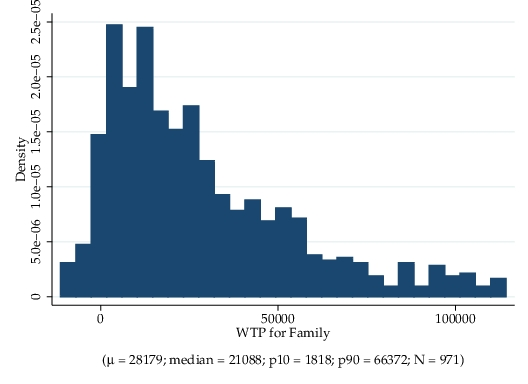

```{r, load_refs, include=FALSE, cache=FALSE}
library(RefManageR)
library(tidyverse)
BibOptions(check.entries = FALSE,
           bib.style = "authoryear",
           style = "markdown",
           hyperlink = FALSE,
           dashed = TRUE)
biblio <- ReadBib("../../References/References.bib", check = FALSE)
```

# Plan for the Day

1. Discuss stated preferences

2. Estimating models using stated preference data

3. Discrete choice experiments

4. Stated probability experiments

---
# Stated preferences (SP) vs. Revealed preferences (RP)

- Up to now, we have been dealing with _revealed preference_ data

- The data we use includes choices that were _actually_ made

- In contrast, we can collect data on .hi[stated preferences]

- This data would include choices that are .hi[hypothetically] made

- See also: "If I had a million dollars" by the band Barenaked Ladies

---
# What are stated preferences?

- SP are derived from hypothetical situations

- e.g. "which of these three trucks would you purchase?"

- I've never purchased a truck before, so I wouldn't know which to choose

- But if I _were_ to purchase a truck, I suppose I'd pick a Toyota Tundra

- SP are tightly related to the counterfactuals we consider

---
# Strengths of SP and weaknesses of RP

.pull-left[
.center[.hi[RP]]
- usually don't know the choice set
- usually unable to observe important variables
- might not have enough variation in important dimension
- limited to settings that currently exist or have existed in the past
- have to worry about equilibrium allocation mechanism
- counterfactuals must be carefully undertaken
]

.pull-right[
.center[.hi[SP]]
- specify the complete choice set
- specify (and observe) all relevant variables
- govern how much variation is in the data
- we can obtain preferences for as-yet unseen settings
- can separate preferences from other parts of system
- individuals report $y$ across many counterfactuals
]


---
# Cons of SP

- They are hypothetical! As such, they may not be grounded in reality

- If I had $1m, would I really buy a(nother) house? How much would I save?

- Data collection can't necessarily be used for multiple purposes

- May requires mastery of survey methodology

---
# Collection of RP data

- RP data is typically collected by governments

- e.g. household surveys, administrative data, etc.

- These data sources typically have many, many uses

- NLSY has been used in .hi[thousands] of papers

- Administrative data can be used for tax collection and economic research

- These data sources are widely available and comparable across time and other contexts

---
# Collection of SP data

- SP data are collected under a much narrower scope

- Individuals answer a series of hypothetical choice scenarios

- The $X$'s in each scenario are randomized

- Usually, the data can only be used for a limited number of research questions

- Because of this, researchers typically collect their own data

- This requires knowledge of best practices in survey methodology / experiments

- It also requires money to fund survey participation

- More work on the front end (survey development) but much easier to analyze

---
# Example hypothetical choice scenarios 

What is the percent chance you would choose to live in each of these three locations given their characteristics below? .hi[Assume that the locations are otherwise identical.]

.hi[Scenario 1]

Option | Distance from current location | Family here | Income | Probability
--------|---------|---------|---------|---------
A (not move) | 0          | No  | 30% lower  | 
B            | 1000 miles | Yes | same       | 
C            | 1000 miles | No  | 30% higher | 


.hi[Scenario 2]

Option | Distance from current location | Family here | Income | Probability
--------|---------|---------|---------|---------
A (not move) | 0          | Yes | 30% lower   | 
B            | 500 miles  | Yes | 150% higher | 
C            | 100 miles  | No  | 60% higher  | 

---
# Guidelines for choice experiments

- Try to keep things as short as possible (respondent fatigue)

- Make sure no option in any scenario is strictly dominated

- Number of options should not exceed 4

- Vary a small number of $X$'s at a time so as not to overload respondents
    - but make sure respondents know to hold all else equal!

- Need sufficient variation in the $X$'s of interest

- Scenarios should match up with real life as much as possible

- Should include a status-quo option if possible

---
# Types of SP choice experiments

- Discrete choice
    - Individuals select which of the $J$ options they prefer
    - i.e. if $J=3$ then the $y$ vector will be $[0,1,0]$, $[1,0,0]$, or $[0,0,1]$

- Rank-ordered choice
    - Individuals provide their preference ordering of the $J$ options

- Probabilistic choice
    - Individuals provide choice probabilities of each of the $J$ options
    
- Each of these settings provides increasing amounts of information

---
# Estimating discrete choice models

- Estimation proceeds as if one has panel data on choices `r Citep(biblio,"rust1987")`

- Each choice scenario is another observation in the individual's panel

- Can estimate assuming multinomial logit, nested logit, mixed logit, etc.

---
# Estimating rank-ordered choice models

- Here, we use the .hi[exploded logit] model `r Citep(biblio,"beggs1981")`

- The "choice probability" is the joint event of a particular ranking of options

- It's a product of logit $P$'s, where the choice set decreases as options are ranked:

\begin{align*}
\Pr\left(\text{Ranking}=1,\ldots,J\right) &= \frac{\exp\left(Z_{i1}\gamma\right)}{\sum_{k=1}^J\exp\left(Z_{ik}\gamma\right)}\frac{\exp\left(Z_{i2}\gamma\right)}{\sum_{k=2}^J\exp\left(Z_{ik}\gamma\right)}\cdots\frac{\exp\left(Z_{iJ-1}\gamma\right)}{\sum_{k=J-1}^J\exp\left(Z_{ik}\gamma\right)}
\end{align*}

- We can also add mixing to these probabilities to get a mixed exploded logit

- Note that rank ordering provides more information than 0/1 choice data

- We now know the relative preference of the $J-1$ non-chosen options

---
# Stated probabilistic choice models

- Now, we observe a probability of choosing each alternative

- What does this information represent? It represents the person's uncertainty

- Specifically, it represents .hi[resolvable uncertainty:] uncertainty about unspecified attributes or states of the world in which choices ultimately will be made 

- e.g. Q. "Will you go for Mexican or Thai food on Friday night?"
    - A. "Well, I'm not sure what mood I'll be in that day, but probably Mexican"
    - Q. "What do you mean by 'probably'?" 
    - A. "A 78% chance"

- If the person thinks there is no such uncertainty, then they can report $p=0$ or $p=1$

---
# Estimating probabilistic choice models

- How do we proceed with estimation when $y$ is itself a probability (not 0/1)?

- We invert the logit formula

- Consider the binomial logit as an example

\begin{align*}
P_{i1} &= \frac{\exp\left(\left(Z_{i1}-Z_{i2}\right)\gamma\right)}{1+\exp\left(\left(Z_{i1}-Z_{i2}\right)\gamma\right)}
\end{align*}

- After some algebra, we get

\begin{align*}
\ln\left(\frac{P_{i1}}{1-P_{i1}}\right) &= \left(Z_{i1}-Z_{i2}\right)\gamma
\end{align*}

- Now we're in a world where we can use OLS to estimate $\gamma$!


---
# Increasing amounts of information

- Stated probabilities provide more information than discrete choice or rank ordering

- Consider the following responses for an individual

Option | Discrete Choice | Rank Ordering | Stated Probability 1 | Stated Probability 2
--------|---------|---------|---------|---------
1 | 0 | 2 | 1   | 49
2 | 1 | 1 | 99  | 51
3 | 0 | 3 | 0   | 0

- The preference ordering is the same in each column

- But the implied preference intensity is much different in the last two columns

- A (0,1,0) discrete choice response corresponds to a (0,100,0) probability response

---
# Measurement error

- One concern with stated probabilities is measurement error

- Rather than report 99.5%, someone may just write 100%

- But if $p=0$ or $p=1$, $\ln\left(\frac{P_{i1}}{1-P_{i1}}\right)$ is undefined!

- In this case, we have to recode 0s or 1s to be small values (e.g. .001, .999)

- Then, to avoid cheating, we need to use LAD instead of OLS. New equation:

\begin{align*}
\ln\left(\frac{\tilde{P}_{i1}}{1-\tilde{P}_{i1}}\right) &= \left(Z_{i1}-Z_{i2}\right)\gamma + \eta_{i1}
\end{align*}
where $\tilde{P}$ is the recoded probability and $\eta_{i1}$ is the difference in measurement errors


---
# Estimation with $J>2$

- The above is the equation for a 2-option choice set

- With more than 2 options, we have more observations per scenario

- If $J=3$, we have 

\begin{align*}
\ln\left(\frac{\tilde{P}_{i1}}{\tilde{P}_{i2}}\right) &= \left(Z_{i1}-Z_{i2}\right)\gamma + \eta_{i1}\\
\ln\left(\frac{\tilde{P}_{i3}}{\tilde{P}_{i2}}\right) &= \left(Z_{i3}-Z_{i2}\right)\gamma + \eta_{i3}
\end{align*}

- If we see $N$ people each making $T$ choices, then our data has $NT(J-1)$ rows


---
# Preference Heterogeneity

- Major advantage of elicited probabilities: handling unobserved heterogeneity

- We can say more because we have more information about preferences

- Stated probabilities contain more information than 0/1 or rank ordering

- Rather than assuming a normal distribution in a mixed logit,

- We can instead trace out the mixing distribution nonparametrically

- We simply estimate individual-specific $\gamma$'s

- Resulting distribution is almost never normal (i.e. it's skewed, etc.)


---
# Example from Kosar et al. (2020)

.center[]

- The WTP distribution is highly skewed
- Some people _really_ like living close to family
- Some people prefer to be apart from family (negative WTP)


---
# Follow-on studies to link to RP data

- Stated probabilistic choice experiments are not a silver bullet

- You're still reduced to the SP vs. RP conundrum

- Will people actually do what they told you they would do?

- To resolve this, most studies have to conduct follow-on surveys

- Rationale: in between survey waves, people make actual choices

- You can then see how well their SP compares to their RP

- I've never seen SP diverge from RP, but that could be due to publication bias

---
# Papers that use stated probability experiments

- `r Citet(biblio,"blass_al2010")`

- `r Citet(biblio,"delavandeManski2015")`

- `r Citet(biblio,"wiswallZafar2018")`

- `r Citet(biblio,"delavandeZafar2019")`

- `r Citet(biblio,"kosar_al2020")`

- Many others


---
# How to estimate probabilstic choice models in Julia

- We can read in data from `r Citet(biblio,"kosar_al2020")`

- Each pair of adjacent rows is a choice scenario

- `ratio` is the log of ratio of the probabilities

.scroll-box-12[
```{julia,eval=F}
using DataFrames, HTTP, CSV, GLM, QuantileRegressions

url = "https://raw.githubusercontent.com/OU-PhD-Econometrics/fall-2020/master/LectureNotes/11-SubjExp/SCEmobilityExample.csv"
df = CSV.read(HTTP.get(url).body)

println(head(df))
│ Row │ scuid  │ ratio    │ dist    │ crime     │ income     │ moved │ scennum │ altnum │ wave  │ mvcost │ family │ norms │ homecost │ size    │ taxes │ schqual │ withincitymove │ copyhome │ blkscen │
│     │ Int64  │ Float64  │ Float64 │ Float64   │ Float64    │ Int64 │ Int64   │ Int64  │ Int64 │ Int64  │ Int64  │ Int64 │ Float64  │ Float64 │ Int64 │ Int64   │ Int64          │ Int64    │ Int64   │
├─────┼────────┼──────────┼─────────┼───────────┼────────────┼───────┼─────────┼────────┼───────┼────────┼────────┼───────┼──────────┼─────────┼───────┼─────────┼────────────────┼──────────┼─────────┤
│ 1   │ 119007 │ 6.85646  │ -5.0    │ -0.693147 │ -0.182322  │ -1    │ 1       │ 1      │ 1     │ 0      │ 0      │ 0     │ 0.0      │ 0.0     │ 0     │ 0       │ 0              │ 0        │ 25      │
│ 2   │ 119007 │ 3.91202  │ 5.0     │ -1.38629  │ -0.0870114 │ 0     │ 1       │ 3      │ 1     │ 0      │ 0      │ 0     │ 0.0      │ 0.0     │ 0     │ 0       │ 0              │ 0        │ 25      │
│ 3   │ 119007 │ 6.85646  │ -5.0    │ 0.0       │ -0.0487902 │ -1    │ 2       │ 1      │ 1     │ 0      │ 0      │ 0     │ 0.0      │ 0.0     │ 0     │ 0       │ 0              │ 0        │ 26      │
│ 4   │ 119007 │ 3.91202  │ 0.0     │ -0.693147 │ -0.0487902 │ 0     │ 2       │ 3      │ 1     │ 0      │ 0      │ 0     │ 0.0      │ 0.0     │ 0     │ 0       │ 0              │ 0        │ 26      │
│ 5   │ 119007 │ 2.94444  │ -5.0    │ 0.693147  │ -0.0571584 │ -1    │ 3       │ 1      │ 1     │ 0      │ 0      │ 0     │ 0.0      │ 0.0     │ 0     │ 0       │ 0              │ 0        │ 27      │
│ 6   │ 119007 │ -3.91202 │ 5.0     │ 1.38629   │ 0.154151   │ 0     │ 3       │ 3      │ 1     │ 0      │ 0      │ 0     │ 0.0      │ 0.0     │ 0     │ 0       │ 0              │ 0        │ 27      │

estimates = qreg(@formula(ratio ~ income + crime + dist + mvcost + family + norms + homecost + size + taxes + schqual + withincitymove + copyhome + moved), df, .5)
Coefficients:
────────────────────────────────────────────────────────────
                Quantile    Estimate   Std.Error     t value
────────────────────────────────────────────────────────────
(Intercept)          0.5  -0.0338533  0.0133281     -2.53999
income               0.5   3.75781    0.0364599    103.067
crime                0.5  -0.640542   0.020861     -30.7053
dist                 0.5  -0.0549714  0.00358389   -15.3385
mvcost               0.5  -0.0397001  0.001884     -21.0722
family               0.5   2.13173    0.0259934     82.0105
norms                0.5   0.154355   0.0155282      9.94031
homecost             0.5  -0.798607   0.0800967     -9.97054
size                 0.5   0.635994   0.043953      14.4699
taxes                0.5  -0.0403194  0.00424806    -9.49124
schqual              0.5   0.238732   0.0167284     14.271
withincitymove       0.5   1.69741    0.0287623     59.0151
copyhome             0.5   0.110198   0.0288403      3.82097
moved                0.5  -2.57907    0.0253557   -101.715
────────────────────────────────────────────────────────────
```
]


---
# Other details for estimation

- You need to bootstrap to get appropriate standard errors

- This is because you have panel data

- Cluster (at individual level) robust inference won't be enough

- To get individual-specific preference estimates, `qreg` at individual level


---
# References
.tiny[
```{r refs, echo=FALSE, results="asis"}
PrintBibliography(biblio)
```
]
