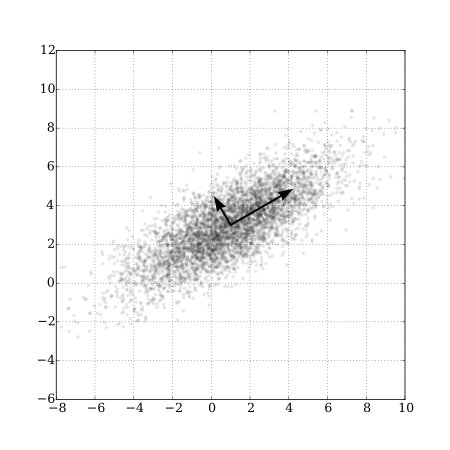

```{r, load_refs, include=FALSE, cache=FALSE}
library(RefManageR)
library(tidyverse)
BibOptions(check.entries = FALSE,
           bib.style = "authoryear",
           style = "markdown",
           hyperlink = FALSE,
           dashed = TRUE)
biblio <- ReadBib("../../References/References.bib", check = FALSE)
```

# Plan for the Day

1. Discuss proxy variables & measurement error

2. Methods for dimensionality reduction

3. Economic content of factor models

4. Examples of factor models


---
# Attribution

I gratefully acknowledge Esteban Aucejo for sharing his slides on factor models, some of which I incorporated in what follows.

I also based some content on `r Citet(biblio,"shalizi2019")` which is an excellent textbook on data analysis.


---
# Proxy variables

- Suppose we have a simple linear regression model

\begin{align*}
y &= X\beta + \varepsilon
\end{align*}

- If $(y,X)$ come from observational data, the model is likely confounded

- That is, our OLS estimate of $\hat{\beta}$ would be biased (because $X$ is correlated with $\varepsilon$)

- One potential way to remove the bias is to include a .hi[proxy variable]

- This is a variable that we can observe and that is related to something in $\varepsilon$

- Example: unobserved ability biases returns to schooling. IQ might be a viable proxy


---
# A brief review of measurement error

- What if our proxy is measured with error? This can cause econometric problems

- In linear regression, under "classical measurement error" (CEV) assumption:

    - OLS estimates are attenuated to zero (i.e. "attenuation bias")
    
    - OLS t-stats are biased downwards

- There are other "non-classical" forms of measurement error as well

- See `r Citet(biblio,"pischke2007")` for a good treatment of ME

- Naturally, measurement error is a beast in non-linear models

- See `r Citet(biblio,"chen_al2011")` for a complete treatment

---
# Proxy variables & measurement error

- Unless they happen to resolve the endogeneity problem, proxy variables won't work

- (Need $\mathbb{E}\left(\varepsilon \vert X, proxy\right) = \mathbb{E}\left(\varepsilon \vert proxy\right)$)

- And usually proxies don't satisfy this requirement

- You can use instrumental variables to solve the ME problem

- But only in linear models

- And, of course, instrument validity is almost always in question

- So it seems you have to choose between omitted variable bias and attenuation bias

---
# What if we have many correlated proxies?

- For the unobserved ability question, we might have many different proxies

- e.g. individuals might take multiple standardized tests

- How do we know which test scores to attempt to use as proxies?

- What if each test itself suffers from measurement error?

- What if the test scores are highly correlated with each other?

- Today we'll talk about how to handle this situation

- The application focuses on measuring ability

- But this approach is generally applicable when we have many noisy measurements

---
# Dimensionality reduction

- .hi[Dimensionality reduction] is a common task in data analysis

- If 3 variables all give the same information, why not just have 1?

- There are two related methods for reducing dimensionality

1. .hi[Principle Components Analysis (PCA)]

2. .hi[Factor Analysis]

---
# PCA

- PCA is one way to reduce dimensionality. Let $M$ be an $N\times J$ matrix of data

- Decompose $M$ as follows:
\begin{align*}
M &= \boldsymbol{\theta}\Lambda\\
[N\times J] &= [N\times J] [J\times J]
\end{align*}

- $\Lambda$ are stacked eigenvectors

- $\boldsymbol{\theta}$ is an .hi[orthogonalized transformation] of $M$ (columns of $\boldsymbol{\theta}$ are uncorrelated)

- $\Lambda$ indicates the rotation angle to get from $\boldsymbol{\theta}$ back to $M$

- If $M$ were orthogonal to begin with, $\Lambda = I$ and $M=\boldsymbol{\theta}$


---
# PCA 2

- Nothing on the previous slide helps us with dimensionality reduction per se

- We reduce dimensionality by choosing the eigenvectors with the largest magnitudes

- These represent the dimensions $\boldsymbol{\theta}$ with the greatest variance

- We say that we "select the first $K$ .hi[principal components] of $M$"

- Mathematically, we "reduce" (i.e. "approximate") $M$ by choosing a subset of $\boldsymbol{\theta}$ and $\Lambda$

\begin{align*}
\widetilde{M} &= \boldsymbol{\theta}_k\Lambda_k\\
[N\times J] &= [N\times K] [K\times J]\\
&\\
M &= \boldsymbol{\theta}_k\Lambda_k + \boldsymbol{\varepsilon}
\end{align*}
where $\boldsymbol{\varepsilon}\equiv M - \widetilde{M}$ is a $N\times J$ matrix


---
# Visual depiction of PCA

.center[]

- The arrows are the eigenvectors; longer arrows correspond to more variance 
(image source: [Wikipedia](https://upload.wikimedia.org/wikipedia/commons/f/f5/GaussianScatterPCA.svg))

---
# Factor Analysis

- Factor Analysis comes in two forms: Exploratory (EFA) and Confirmatory (CFA)
    
    - EFA: see what factors might be in the data
    
    - CFA: write down a model and use the data to test it

- In economics, we pretty much only do CFA

- FA is used extensively in psychometrics

- It is a natural tool for analyzing cognitive or behavioral tests

    - Each test measures some set of skills, but does so noisily
    
    - Tests tend to measure the same set of skills, so they are correlated

---
# How factor analysis works

- Suppose our $J$ columns of $M$ correspond to measurements (e.g. test scores)

- FA tries to find some underlying unobservables that commonly affect $M$

- We assume that we cannot observe $\boldsymbol{\theta}$

- If we assume that $M$ is standardized (mean-zero, unit-variance), then

\begin{align*}
M &= \underbrace{\boldsymbol{\theta}_k\Lambda_k + \boldsymbol{\varepsilon}}_{\boldsymbol{u}}
\end{align*}

- $u$ is a composite error term (since both $\boldsymbol{\theta}$ and $\varepsilon$ are unobservable)

- In FA, we call $\boldsymbol{\theta}$ .hi[factors], and we call $\Lambda$ .hi[factor loadings] and $\boldsymbol{\varepsilon}$ .hi[uniquenesses]


---
# PCA vs. FA

- Clearly, PCA and FA are related, but there are important differences

- The $\boldsymbol{\theta}_k$ we get from PCA and FA are going to be different

- But the $\Lambda_k$ are identical (and hence the $\boldsymbol{\varepsilon}$ are different)

- $\boldsymbol{\theta}_k^{PCA}$ has larger variance than $\boldsymbol{\theta}_k^{FA}$

- This is because PCA treats $M$ as not measured with error, but FA does the opposite

- For many more excellent details, see `r Citet(biblio,"shalizi2019")`  [here](http://www.stat.cmu.edu/~cshalizi/uADA/12/lectures/ch19.pdf)

---
# Extensions of FA

- We can extend FA to allow for $X$'s that affect our measurements

\begin{align*}
M &= X\boldsymbol{\beta} + \underbrace{\boldsymbol{\theta}_k\Lambda_k + \boldsymbol{\varepsilon}}_{\boldsymbol{u}} \\
[N\times J] &= [N\times L] [L\times J] + [N\times K] [K\times J] + [N\times J]
\end{align*}

- If $X$ is $N\times L$ then $\boldsymbol{\beta}$ is a $L\times J$ matrix

- However, we do need to make more assumptions for econometric identification!

---
# Identifying assumptions for a 2-factor model

- We need to make the following assumptions:

\begin{align*}
\mathbb{E}\left(\boldsymbol{\varepsilon}\right) &= \mathbf{0}_{J\times 1}\\
\mathbb{V}\left(\boldsymbol{\varepsilon}\right) &\equiv \mathbb{E}\left(\boldsymbol{\varepsilon}'\boldsymbol{\varepsilon}\right)=\Omega_{J\times J}\\
\Omega_{[j,j]} &= \sigma^2_j, \Omega_{[j,k]} = 0\\
\mathbb{E}\left(\boldsymbol{\theta}\right) &= \mathbf{0}_{2\times 1}\\
\mathbb{V}\left(\boldsymbol{\theta}\right) &= \Sigma_\boldsymbol{\theta}
\end{align*}

- Let $u \equiv M - X\boldsymbol{\beta}$, then
\begin{align*}
\mathbb{E}\left(u\right) &= \mathbf{0}_{J\times 1}\\
\mathbb{V}\left(u\right) &= \Lambda\Sigma_\boldsymbol{\theta}\Lambda' + \Omega\\
\Sigma_\boldsymbol{\theta} &= \left[\begin{array}{cc}
\sigma^2_{\theta_1} & \sigma_{\theta_1 \theta_2}\\
\sigma_{\theta_1 \theta_2} & \sigma^2_{\theta_2}\\
\end{array}\right]
\end{align*}

---
# Identification of a 2-factor model

- Our only data source to estimate $\Lambda$ and $\Sigma_\boldsymbol{\theta}$ is $\mathbb{V}\left(M-X\boldsymbol{\beta}\right)\equiv \mathbb{V}\left(u\right)$

- Let's look at the variance-covariance matrix of $u$:

    - This has $J$ diagonal elements and $\frac{J(J-1)}{2}$ unique off-diagonal elements

- With these $J+\frac{J(J-1)}{2}$ moments in the data, we want to estimate:
    - The $J$ diagonal elements of $\Omega$ (i.e. the $\sigma^2_j$'s)
    - $2J$ elements of $\Lambda$
    - four elements of $\Sigma_\boldsymbol{\theta}$

- We have $3J+4$ parameters, but only $J+\frac{J(J-1)}{2}$ data moments

- In general, the model is not identified. We will need to impose further assumptions.


---
# Additional identifying assumptions

- The following are common assumptions, but you could impose others

1. $\theta_1 \perp \theta_2$ (so $\Sigma_\boldsymbol{\theta}$ is diagonal)

2. The scale of each factor is arbitrary. 2 ways to normalize the scale:
    - $\Sigma_\boldsymbol{\theta} = I_{2\times 2}$
    - or
    - Set one element of each row of $\Lambda=1$
    
- With these two assumptions, we achieve identification if

\begin{align*}
2J + J \leq J+\frac{J(J-1)}{2}
\end{align*}

- So $J\geq 5$ is necessary (but not sufficient) for identification


---
# Other identification considerations

- For .hi[model interpretability], also need to put more structure on $\Lambda$

- For example, suppose we have 6 measurements: 
    - 3 from a cognitive test and 3 from a personality test

- In this case, the first row of $\Lambda$ should be 0 for the personality measures

- Likewise, the second row of $\Lambda$ should be 0 for the cognitive measures

- If all 6 measurements come from a cog. test, can't identify a non-cog. factor

- Could possibly identify $\sigma_{\theta_1\theta_2}$ if one measurement measures both factors


---
# Estimation of factor models

- Typically, we impose distributional assumptions on $\boldsymbol{\theta}$ and $\boldsymbol{\varepsilon}$

- e.g. assume $\boldsymbol{\theta}$ and $\boldsymbol{\varepsilon}$ are each MVN with 0 covariance and $\boldsymbol{\theta} \perp \boldsymbol{\varepsilon}$

- Then we estimate $(\Lambda, \Sigma_\boldsymbol{\theta}, \Omega)$ by maximum likelihood

- The likelihood function will need to be integrated, since $\boldsymbol{\theta}$ is unobserved

- Can use quadrature, simulated method of moments, MCMC, or the EM algorithm

    - As you know, these vary in their ease of use


---
# Using factor models to $\downarrow$ bias of regression estimates

- The whole reason we use a factor model is to reduce bias

- Let's go back to the log wage example from the start of today

    - $\beta$'s are biased if we omit cognitive ability (omitted variable bias)
    
    - $\beta$'s are also biased if we include IQ score (attenuation bias from meas. err.)

- We know cognitive ability affects wages, and we have (noisy) measurements of it

- We can estimate the log wage parameters by maximum likelihood

- We combine together the log wage and factor model likelihoods

- I'll walk you through how to do this in the Problem Set (due next time)

---
# Factor models and dynamic selection

- Factor models can also be used to account for dynamic selection

- Intuition: $\uparrow$ cog. abil $\Rightarrow \uparrow$ schooling $\Rightarrow \uparrow$ wages

- Schooling is endogenous, so we can add a schooling choice model to our likelihood

- When the ability factor enters choice of schooling, this induces a correlation between schooling choices and wages

- But conditional on the factor, we have separability of the likelihood components

- $\mathcal{L} = \int_A \underbrace{\mathcal{L}_1(A)}_{\text{measurements}}\underbrace{\mathcal{L}_2(A)}_{\text{choices}}\underbrace{\mathcal{L}_3(A)}_{\text{wages}} dF(A)$

- We covered a variant of this case back when we discussed Mixed Logit


---
# Seminal papers applying factor analysis

- `r Citet(biblio,"heckmanStixrudUrzua2006")`
    
    - first paper to apply this method to an econometric model
    
    - show that this method works
    
    - 2 latent factors impact a variety of outcomes
    
- `r Citet(biblio,"cunha_al2010")`

    - develop a dynamic factor model of early childhood skill production
    
    - latent ability in one period affects investment in subsequent periods


---
# Recent papers

- `r Citet(biblio,"aucejoJames2019")`
    - Why do women attain more education than men, especially among Blacks?
    - Use 59 measures of early student information 
    - 3 factors: family background, math/verbal skills, externalizing behavior
    - Family background differences drive most of the observed gaps

- `r Citet(biblio,"ashworth_al2020")`
    - Estimate wage returns to schooling and different types of work experience
    - 2 factors: cognitive and "not" cognitive
    - Accounting for selection matters a lot for calculation of returns to schooling

---
# References
.smallest[
```{r refs, echo=FALSE, results="asis"}
PrintBibliography(biblio)
```
]
