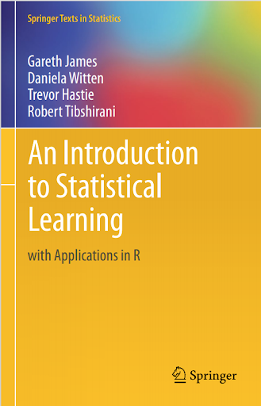
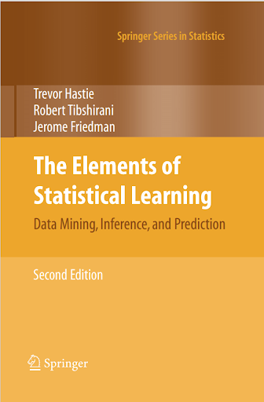
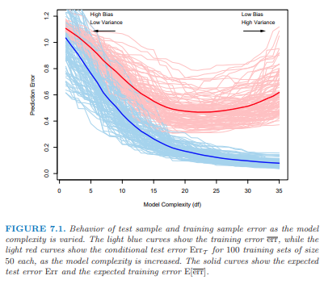

```{r setup, include=FALSE}
knitr::opts_chunk$set(warning = FALSE, message = FALSE, 
                      fig.retina = 3, fig.align = "center")
```

```{r, load_refs, include=FALSE, cache=FALSE}
library(RefManageR)
library(tidyverse)
BibOptions(check.entries = FALSE,
           bib.style = "authoryear",
           style = "markdown",
           hyperlink = FALSE,
           dashed = TRUE)
biblio <- ReadBib("../../References/References.bib", check = FALSE)
```

# Attribution

Today's material is based on the two main Statistical Learning textbooks:

.pull-left[
.center[
```{r, eval=T, include=T, echo=F, out.height = "90%"}
 
```
.small[`r Citet(biblio,"islrbook")`]
]
]

.pull-right[
.center[
```{r, eval=T, include=T, echo=F, out.height = "90%"}
 
```
.small[`r Citet(biblio,"eslrbook")`]
]
]

---
# Plan for the Day

1. What is Machine Learning (ML)?

2. Broad overview

3. How to do ML in Julia

Next time, we'll discuss how ML is being used with econometrics


---
# Machine Learning and Artifical Intelligence (AI)

- .hi[Machine learning (ML):] Allowing computers to learn for themselves without explicitly being programmed

    - USPS: Computer to read handwriting on envelopes
    
    - Google: AlphaGo Zero, computer that defeated world champion Go player
    
    - Apple/Amazon/Microsoft: Siri, Alexa, Cortana voice assistants 
    
- .hi[Artificial intelligence (AI):] Constructing machines (robots, computers) to think and act like human beings

- ML is a subset of AI

---
# Prediction vs. Inference

- Prediction and Inference are the two main reasons for analyzing data

- .hi[Prediction:] We simply want to obtain $\hat{Y}$ given the $X$'s

- .hi[Inference:] Understanding how changing the $X$'s will change $Y$

- Three types of inference, according to [Andrew Gelman](https://andrewgelman.com/2018/08/18/fallacy-excluded-middle-statistical-philosophy-edition/)

   1. Generalizing from sample to population (statistical inference)
   
   2. Generalizing from control state to treatment state (causal inference)
   
   3. Generalizing from observed measurements to underlying constructs of interest

- Philosophically, these can each be framed as prediction problems


---
# Inference as Prediction

- How can each type of inference be framed as a prediction problem?

- Statistical inference:

    - Predict what $Y$ (or $\beta$) would be in a different sample
    
- Causal inference:

    - Predict what $Y$ would be if we switched each person's treatment status

- Measurement quality:

    - Predict what $Y$ would be if we could better measure it (or the $X$'s)
    
    - e.g. personal rating in Harvard admissions (what does it measure?)

---
# Vocabulary

Econometrics and Machine Learning use different words for the same objects

.pull-left[

.hi[Econometrics]

- Dependent variable

- Covariate

- Observation

- Objective function

- Estimation

]

.pull-right[

.hi[Machine Learning]

- Target variable

- Feature

- Example (Instance)

- Cost function (Loss function)

- Training (Learning)

]

---
# The goal of machine learning

Machine learning is all about automating two hand-in-hand processes:

1. Model selection

    - What should the specification be?

2. Model validation

    - Does the model generalize to other (similar) contexts?

- Want to automate these processes to maximize predictive accuracy

    - As defined by some cost function

- This is .hi[different] than the goal of econometrics! (causal inference)

---
# Training, validation and test data

- In econometrics, we typically use the entire data set for estimation

- In ML, we assess out-of-sample performance, so we should hold out some data

- Some held-out data is used for validating the model, and some to test the model

- Data used in estimation is referred to as .hi[training data] (60%-70% of sample)

- Data we use to test performance is called .hi[test data] (10%-20%)

- Data we use to cross-validate our model is called .hi[validation data] (10%-20%)

- Division of training/validation/test sets should be .hi[random]

---
# Model complexity and the bias/variance tradeoff

- There is a trade-off between bias and variance

\begin{align*}
\underbrace{\mathbb{E}\left(y-\hat{f}(x)\right)^2}_{\text{Expected }MSE\text{ in test set}} &= \underbrace{\mathbb{V}\left(\hat{f}(x)\right)}_{\text{Variance}} + \underbrace{\left[\text{Bias}\left(\hat{f}(x)\right)\right]^2}_{\text{Squared Bias}} + \underbrace{\mathbb{V}\left(\epsilon\right)}_{\text{Irreducible Error}}
\end{align*}

- A model with high .hi[bias] is a poor approximation of reality

- A model with high .hi[variance] is one that does not generalize well to a new data set

- A model is .hi[overfit] if it has low bias and high variance

- A model is .hi[underfit] if it has high bias and low variance

---
# Visualizing the bias/variance tradeoff

.center[]

- Optimal model complexity is at the minimum of the red line
- Irreducible error means that the red line can't go below a certain level
    - maybe at 0.3 in this picture?
- Image source: `r Citet(biblio,"eslrbook")`

---
# Continuous vs. categorical target variables

- When the target variable is continuous, we use $MSE$ to measure fit

- When it is categorical, we use .hi[accuracy] or similar measures

    - or some combination of specificity and sensitivity
    
    - goal is to not have a good "fit" by randomly guessing
    
    - so each potential metric penalizes random guessing

---
# Different types of learning algorithms

- Just like in econometrics, the most basic "learning algorithm" is OLS

- Or, if $Y$ is categorical, logistic regression

- But, we know there are many other ways to estimate models

- e.g. non-parametric, semi-parametric, Bayesian, ...


---
# Supervised and unsupervised learning

- .hi[Supervised learning:] we predict $Y$ from a set of $X$'s

- .hi[Unsupervised learning:] we try to group observations by their $X$'s

- Most of econometrics is about supervised learning (i.e. estimate $\hat{\beta}$)

- But there are some elements of unsupervised learning

    - Particularly with regards to detecting unobserved heterogeneity types
    
    - e.g. factor analysis (detect types based on a set of measurements)
    
    - e.g. the EM algorithm (detect types based on serial correlation of residuals)

---
# Supervised learning algorithms

Examples of supervised learning algorithms:

- Tree models
    - Basically a fully non-parametric bin estimator
    - Can generalize to "forests" that average over many "trees"

- Neural networks
    - Model the human brain's system of axons and dendrites
    - "Input layer" is the $X$'s, "Output layer" is $Y$
    - "Hidden layers" nonlinearly map the input and output layers
    - Mapping ends up looking like a logit of logit of logits

---
# Supervised learning algorithms (continued)

- Bayesian models

    - Bayes' rule can be thought of as a learning algorithm
    
    - Use it to update one's prior

- Support Vector Machine (SVM)

    - Originally developed for classification
    
    - Tries to divide 0s and 1s by as large of a margin as possible
    
    - Based on representing examples as points in space
    
    - Generalization of the maximal margin classifier

---
# Unsupervised learning algorithms

- We covered the EM algorithm and PCA in previous lectures

- $k$-means clustering

   - Attempts to group observations together based on the $X$'s
   
   - Choose cluster labels to minimize difference in $X$'s among labeled observations

\begin{align*}
& \min_{C_1,\ldots,C_K} \sum_{k=1}^K \frac{1}{N_k}\sum_{i\in C_k}\sum_{\ell=1}^L\left(x_{i\ell}-\overline{x}_{\ell j}\right)^2 \\
\end{align*}

$N_k$ is the number of observations in cluster $k$, $L$ is number of $X$'s
    
- Can choose other metrics besides Euclidean distance

---
# Active learning algorithms

- .hi[Active learning:] algorithm chooses the next example it wants a label for

- Balances "exploration" and "exploitation"

- Two common examples of active learning:

1. .hi[Reinforcement learning] powers the world-beating chess engines

    - These algorithms use dynamic programming methods
    
    - Use Conditional Choice Probabilities for computational gains
    
2. .hi[Recommender systems] power social networks, streaming services, etc.


---
# Back to the bias-variance tradeoff

- The Bias-Variance Tradeoff applies to supervised learning

- How do we ensure that our model is not overly complex (i.e. overfit)?

- The answer is to penalize complexity

- .hi[Regularization] is the way we penalize complexity

- .hi[Cross-validation] is the way that we choose the optimal level of regularization

---
# How cross-validation works  `r Citep(biblio,"adams2018")`

.center[]

- Blue is the data that we use to estimate the model's parameters
- We randomly hold out $K$ portions of this data one-at-a-time (Green boxes)
- We assess the performance of the model in the Green data
- This tells us the optimal complexity (by "hyperparameters" if CV is automated)


---
# Types of regularization

- Regularization is algorithm-specific

    - in tree models, complexity is the number of "leaves" on the tree
    
    - in linear models, complexity is the number of covariates
    
    - in neural networks, complexity is the number/mapping of hidden layers
    
    - in Bayesian approaches, priors act as regularization

- Whatever our algorithm, we can tune the complexity parameters using CV

---
# Regularization of linear-in-parameters models

There are three main types of regularization for linear-in-parameters models:

1. $L0$ regularization (Subset selection)

2. $L1$ regularization (LASSO)

3. $L2$ regularization (Ridge)

---
# $L0$ regularization

- Suppose you have $L$ $X$'s you may want to include in your model

- Subset selection automatically chooses which ones to include

- This is an automated version of what is traditionally done in econometrics
    
- Can use Adjusted $R^2$ to penalize complexity

    - or AIC, BIC, or a penalized SSR

- Algorithm either starts from 0 $X$'s and moves forward

- Or it starts from the full set of $X$'s and works backward

- But this won't work if $L>N$! (i.e. there are more $X$'s than observations)

---
# $L1$ and $L2$ regularization

- Consider two different penalized versions of the OLS model:

\begin{align*}
&\min_{\beta} \sum_i \left(y_i - x_i'\beta\right)^2 + \lambda\sum_k \vert\beta_k\vert & \text{(LASSO)} \\
&\min_{\beta} \sum_i \left(y_i - x_i'\beta\right)^2 + \lambda\sum_k \beta_k^2 & \text{(Ridge)} 
\end{align*}

- .hi[LASSO:] Least Absolute Shrinkage and Selection Operator

    - sets some $\beta$'s to be 0, others to be attenuated in magnitude

- .hi[Ridge:]

    - sets each $\beta$ to be attenuated in magnitude

---
# $L1$ and $L2$ regularization (continued)

- We want to choose $\lambda$ to optimize the bias-variance tradeoff

- We choose $\lambda$ by $k$-fold Cross Validation

- We can also employ a weighted average of $L1$ and $L2$, known as .hi[elastic net]

\begin{align*}
&\min_{\beta} \sum_i \left(y_i - x_i'\beta\right)^2 + \lambda_1\sum_k \vert\beta_k\vert + \lambda_2\sum_k \beta_k^2  \\
\end{align*}

where we choose $(\lambda_1,\lambda_2)$ by cross-validation

- $L1$ and $L2$ are excellent for problems where $L>N$ (more $X$'s than observations)

- We can apply $L1$ and $L2$ to other problems (logit, neural network, etc.)

---
# How to estimate ML models

- R, Python and Julia all have excellent ML libraries

- Each language also has a "meta" ML library

    - [`mlr3`](https://mlr3.mlr-org.com/) (R), [`scikit-learn`](https://scikit-learn.org/stable/) (Python), [`MLJ.jl`](https://alan-turing-institute.github.io/MLJ.jl/dev/) (Julia)

- In these libraries, the user specifies $Y$ and $X$

- With only a slight change in code, can estimate a completely different ML model

    - e.g. go from a logit to a tree model with minimal code changes
    
    - e.g. choose values of tuning parameters by $k$-fold CV
    
- I'll go through a quick example with `MLJ.jl`

---
# `MLJ` example

After installing the required packages:

```{julia, eval=F}
using MLJ, Tables, DataFrames, MLJDecisionTreeInterface, MLJLinearModels

models()
```

will list all of the models that can interface with `MLJ`:
```{julia, eval=F}
151-element Array{NamedTuple{(:name, :package_name, :is_supervised, :docstring, :hyperparameter_ranges, :hyperparameter_types, :hyperparameters, :implemented_methods, :is_pure_julia, :is_wrapper, :load_path, :package_license, :package_url, :package_uuid, :prediction_type, :supports_online, :supports_weights, :input_scitype, :target_scitype, :output_scitype),T} where T<:Tuple,1}:
 (name = ARDRegressor, package_name = ScikitLearn, ... )
 (name = AdaBoostClassifier, package_name = ScikitLearn, ... )
 (name = AdaBoostRegressor, package_name = ScikitLearn, ... )
 ⋮
 (name = XGBoostClassifier, package_name = XGBoost, ... )
 (name = XGBoostCount, package_name = XGBoost, ... )
 (name = XGBoostRegressor, package_name = XGBoost, ... )
```


---
# `MLJ` example (continued)

.scroll-box-18[
```{julia, eval=F}
# use house price data from US Census Bureau
df = OpenML.load(574) |> DataFrame
X = df[:,[:P1,:P5p1,:P6p2,:P11p4,:P14p9,:P15p1,:P15p3,:P16p2,:P18p2,:P27p4,:H2p2,:H8p2,:H10p1,:H13p1,:H18pA,:H40p4]]
X = Tables.rowtable(X)
y = log.(df.price)

models(matching(X,y))

# declare a tree and lasso model
tree_model = @load DecisionTreeRegressor pkg=DecisionTree
lasso_model = @load LassoRegressor pkg=MLJLinearModels

# initialize "machines" where results can be reported
tree = machine(tree_model, X, y)
lass = machine(lasso_model, X, y)

# split into training and testing data
train, test = partition(eachindex(y), 0.7, shuffle=true)

# train the models
MLJ.fit!(tree, rows=train)
MLJ.fit!(lass, rows=train)

# predict in test set
yhat = MLJ.predict(tree, X[test,:]);
yhat = MLJ.predict(lass, X[test,:]);

# get RMSE across validation folds
MLJ.evaluate(tree_model,  X, y, resampling=CV(nfolds=6, shuffle=true), measure=rmse)
MLJ.evaluate(lasso_model, X, y, resampling=CV(nfolds=6, shuffle=true), measure=rmse)
```
]

---
# References
```{r refs, echo=FALSE, results="asis"}
PrintBibliography(biblio)
```
