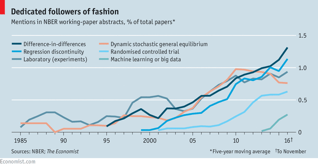

```{r setup, include=FALSE}
knitr::opts_chunk$set(warning = FALSE, message = FALSE, 
                      fig.retina = 3, fig.align = "center")
```

```{r, load_refs, include=FALSE, cache=FALSE}
library(RefManageR)
library(tidyverse)
BibOptions(check.entries = FALSE,
           bib.style = "authoryear",
           style = "markdown",
           hyperlink = FALSE,
           dashed = TRUE)
biblio <- ReadBib("../../References/References.bib", check = FALSE)
```

# Plan for the Day

Go over a number of econ papers that use machine learning methods

---
# Publishing fads

.center[]

[Image source](https://www.economist.com/finance-and-economics/2016/11/24/economists-are-prone-to-fads-and-the-latest-is-machine-learning)

---
# $k$-means clustering and unobserved types

- `r Citet(biblio,"blm2019")`

- Panel data model where unobserved heterogeneity is continuous in the population

- But approximated in the model with a discrete distribution (Group Fixed Effects, GFE)

- Propose a 2-step estimation algorithm:

    1. Classify units into groups using $k$-means clustering
    
    2. Estimate the model using the groups in step 1

- This is different from finite mixture models: no joint estimation required!

---
# Assumptions of BLM (2019)

There are two main assumptions: 

1. Unobserved heterogeneity depends on a low-dimensional vector of latent types

    - This is similar to the conditions of a factor model
    
    - But this method doesn't require a factor structure
    
2. Underlying types can be approximated from individual-specific moments
 
    - Moments can come from the data (e.g. a battery of test scores)
    
    - They can also come from the model (e.g. choice probabilities)
    
---
# Further considerations

- The $k$-means objective function is not globally concave

- This means you will need to search for the global minimum

- Consider the log likelihood of a dynamic discrete choice model:

\begin{align*}
\ell_i\left(\alpha_i,\theta; d_{it},X_{it},Y_{it}\right) &= \sum_t \underbrace{\ln f\left(d_{it}\vert X_{it},\alpha_i,\theta\right)}_{\text{choices}} + \underbrace{\ln f\left(X_{it}\vert d_{it-1},X_{it-1},\alpha_i,\theta\right)}_{\text{state transitions}} + \\
&\phantom{=\sum_t} \underbrace{\ln f\left(Y_{it}\vert d_{it},X_{it},\alpha_i,\theta\right)}_{\text{outcomes}}
\end{align*}

- Likelihoods are assumed to be additively separable conditional on the FE $\alpha_i$


---
# Extensions

- You can incorporate covariates into the $k$-means step

- This can often improve performance

- You can also incorporate model moments in the first step

- This is required if you don't have external measurements (like test scores)

- Another thing to keep in mind is that the GFE is inherently biased

- You may need to iterate on the 2-step estimator multiple times to correct for this

---
# Using ML to solve the sample selection problem

- `r Citet(biblio,"heckman1979")` outlines the canonical sample selection problem

- e.g. we only observe the earnings of individuals who are employed

- This might distort our estimates of wage returns to skill

- Can we improve on this by using machine learning?

    - Especially if the choice dimension is much larger than work/not work?

---
# `r Citet(biblio,"ransom2020")`

- Considers geographic heterogeneity in wage returns to college major

- Individuals choose where they live based on wages and non-wage factors

- Problem: researcher only sees wages in chosen residence location

- Thus, wage returns are potentially contaminated by selection bias

---
# Resolving the selection problem

- Heckman model: the inverse Mill's ratio $\lambda(\cdot)$ corrects for selection

\begin{align*}
\ln wage &= X\beta + \lambda\left(Z\gamma\right) + u
\end{align*}

- One can generalize this approach to multinomial choice and non-normality
\begin{align*}
\ln wage &= X\beta + \sum_j d_j\widetilde{\lambda}\left(p_j(Z),p_k(Z)\right) + u
\end{align*}
where
    - $d_j$ is a dummy for living in location $j$
    - $\widetilde{\lambda}$ is a flexible function
    - $p_j$ and $p_k$ are probabilities of choosing $j$ or $k$ (as a function of $Z$)

---
# Using a tree model to estimate selection

- The $p$'s on the previous slide are selection probabilities

- $p_j$ is the probability of choosing the chosen alternative

- $p_k$ is the probability of choosing the next-preferred alternative

- Use a classification tree model to obtain the $p$'s

- Assume that individuals with same values of $Z$ and similar $p$'s have identical tastes

- This approach improves on a bin-estimation approach

    - Can include a higher dimension of $Z$ while limiting the curse of dimensionality


---
# Can LASSO improve causal inference?

- Shifting gears, let's talk about how model selection might improve causal inference

- Thought experiment:

    - Methods such as matching and regression rely on unconfoundedness
    
    - If we have high-dimensional data, we can "control for everything"!
    
    - This would give us a high $R^2$ and remove any omitted variable bias
    
    - LASSO can potentially select only the most important variables
    
---
# Prediction problems

- The problem with the above thought experiment is that LASSO only predicts

- If we took a slightly different sample, it might select different variables

- This is because LASSO doesn't care about inference, it cares only about prediction

- `r Citet(biblio,"mullainathanSpiess2017")` illustrate this in their Figure 2

- 2 functions with very different coefficients can produce the exact same prediction

- To use ML in econometrics, we need to be more principled about ML's role

---
# Regularization bias

- In econometrics, we like our estimators to be CAN (Consistent & Asym Normal)

- Suppose we want to estimate a treatment effect $\theta$ in a high-dimensional model

\begin{align*}
Y &= D\cdot\theta + g(X) + U, & \mathbb{E} \left[U | X, D \right] =0
\end{align*}

- We might want to use LASSO, ridge, random forest, etc. since $X$ is high-dimensional

- This solves the bias/variance tradeoff, but introduces bias into $\hat\theta$

- Why? Because the bias/variance tradeoff trades off .hi[regularization bias] and variance

- See `r Citet(biblio,"chernozhukov_al2018")`

---
# Double ML estimation

- How do we solve the regularization bias problem? Add another equation

- Consider outcome and selection equations, respectively
\begin{align*}
Y &= D\cdot\theta + g(X) + U, & \mathbb{E} \left[U | X, D \right] =0 \\
D &= m(X) + V, & \mathbb{E} \left[V | X\right] =0
\end{align*}

- We include the second equation to .hi[orthogonalize] $D$

- We also need to .hi[split our sample] to be able to estimate this system

- Instead of using $D$, we use $\hat V = D - \hat{m}(X)$

- This idea is related to the concept of control functions


---
# Steps for Double ML

(0.) Divide the sample in half; one subsample labeled $I^C$ and the other labeled $I$

1. Estimate $\hat V = D - \hat{m}(X)$ in $I^C$

2. Estimate $\hat U = Y - \hat{g}(X)$ in $I^C$

3. Estimate $\check \theta = \left(\hat{V}'D\right)^{-1}\hat{V}'\hat{U}$ in $I$ (cf. biased $\hat \theta = \left(D'D\right)^{-1}D'\hat{U}$)

4. Repeat steps 1-3, but switch $I^C$ and $I$ (this is known as cross-fitting)

5. $\check \theta_{cf} = \frac{1}{2} \check \theta(I^C,I)+ \frac{1}{2} \check \theta(I,I^C)$

- These steps ensure that $\check \theta$ is unbiased and efficient

- Nice examples in [R](https://www.r-bloggers.com/2017/06/cross-fitting-double-machine-learning-estimator/) and [Python](http://aeturrell.com/2018/02/10/econometrics-in-python-partI-ML/)

---
# Post Double Selection (PDS)

- Now let's consider a related idea to Double ML

- This is known as .hi[post double selection] `r Citep(biblio,"belloni_al2014")`

- It is a useful way to estimate treatment effects in linear models

- Same setup as Double ML, but here $g(\cdot)$ and $m(\cdot)$ are linear

\begin{align*}
Y &= D\cdot\theta + g(X) + U, & \mathbb{E} \left[U | X, D \right] =0 \\
D &= m(X) + V, & \mathbb{E} \left[V | X\right] =0
\end{align*}


---
# PDS steps

1. Use LASSO to separately select $X$

    - First on $Y = g(X) + \tilde U$
    
    - Then on $D = m(X) + V$
    
2. Regress $Y$ on $D$ and the union of the selected $X$'s from step 1

- The procedure is called "post double selection" because the final regression is on the set of $X$'s that have been doubly selected (first in the outcome equation, then in the selection equation)

- Key idea is that we avoid regularization bias by only looking at the selection part of LASSO (not the shrinkage part)

---
# Usefulness of PDS

- For an example, let's re-evaluate `r Citet(biblio,"donohueLevitt2001")`

- Their claim: legalizing abortion reduces crime

    - Intuition: unwanted children are most likely to become criminals

- Use a "two-way fixed effects" model on state-level panel data:

\begin{align*}
y_{st} &= \alpha a_{st} + \beta w_{st} + \delta_s + \gamma_t + \varepsilon_{st}
\end{align*}

where $s$ is US state, $t$ is time, and $a_{st}$ is the abortion rate (15-25 years prior)

- $y_{st}$ are various measures of crime (property, violent, murder, ...)

- $w_{st}$ are state-level controls (prisoners per capita, police per capita, ...)

---
# Re-evaluating `r Citet(biblio,"donohueLevitt2001")`

- A potential issue with `r Citet(biblio,"donohueLevitt2001")`: specification of $w_{st}$

- We might think we should include highly flexible forms of elements of $w_{st}$

- Indeed, when `r Citet(biblio,"belloni_al2014")` do this, the SE's get larger

- All previous results are diminished in magnitude and have 5x larger SE's

- The PDS approach is also useful for other regression designs such as DiD

---
# Heterogeneous treatment effects

- ML can also help us with treatment effect heterogeneity

- See `r Citet(biblio,"atheyImbens2016")`

- Use regression trees to partition units into groups with similar TE's

- Estimation is "honest" in a similar way as Double ML:

    - Split the sample in half
    
    - Use one subsample to do the partitioning
    
    - Use the other subsample to estimate the TE's


---
# Matrix completion

- Causal inference is fundamentally a missing data problem

- This is because we only ever observe $Y=D_0 Y_0 + D_1 Y_1$

- `r Citet(biblio,"athey_al2018")` propose .hi[matrix completion] methods for panel data

- This is a credible data imputation technique

- Estimate the ATE by imputing $Y_0$ for treated units

- Take into account within-unit serial correlation

---
# Further reading

- `r Citet(biblio,"bajari_al2015")`

    - Examples of using ML in IO demand estimation

- `r Citet(biblio,"dube_al2020")`

    - Example of using Double ML to estimate employer monopsony power

- `r Citet(biblio,"angristFrandsen2019")`

    - Discussion of the role ML should play in empirical labor economics

---
# References
.tinier[
```{r refs, echo=FALSE, results="asis"}
PrintBibliography(biblio)
```
]
